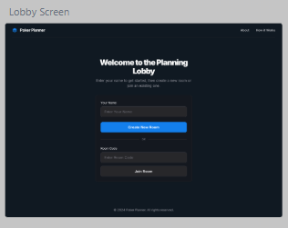
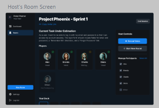
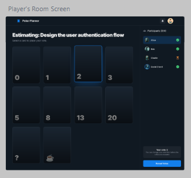
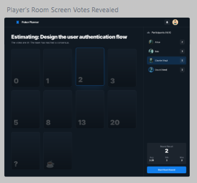
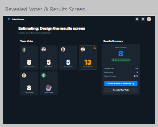

# Product Vision: Poker Planning Neo

## Vision Statement
**Poker Planning Neo** aims to be the most seamless, visually stunning, and frictionless estimation tool for modern agile teams. We strip away the clutter of legacy planning tools and focus on what matters: **speed, clarity, and collaboration**.

## Core Values
1.  **Zero Friction:** No signup required to start. One-click room creation. Instant joining.
2.  **Visual Excellence:** A premium, modern aesthetic that makes planning feel like a professional activity, not a chore.
3.  **Real-Time Sync:** Instant state propagation using Firebase. No refreshing, no lag.
4.  **Mobile First:** Fully responsive design that works perfectly on phones for hybrid teams.

## Target Audience
-   Agile Development Teams
-   Product Managers
-   Scrum Masters
-   Remote & Hybrid Teams

## Key Differentiators (The "Neo" Factor)
-   **Modern UI/UX:** Dark mode by default, glassmorphism, smooth animations.
-   **Smart Defaults:** Standard Fibonacci deck, easy reset flows.
-   **Host Powers:** Clear control over the flow (reveal, reset, kick).

## Future Direction (To be discussed)
-   **Integrations:** Jira/Linear/GitHub issue import?
-   **Stats:** Velocity tracking?
-   **Customization:** Custom decks?

## Design Mockups

### Lobby Screen

### Host Dashboard

### Player Room (Voting)

### Player Room (Revealed)

### Results Summary

