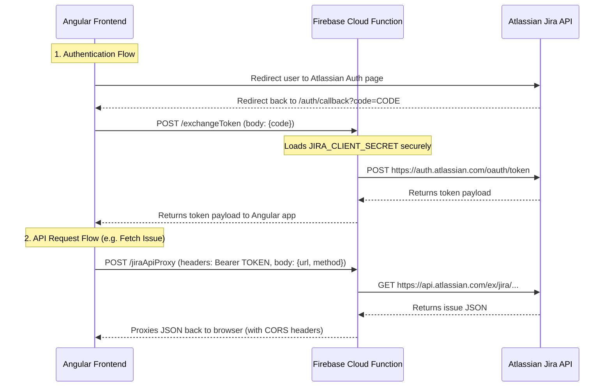

# Technical Specifications: Jira OAuth 2.0 Integration & API Proxy

**Status:** Implemented & Verified (Local Emulator)

## 🎯 Goal
Provide a secure integration with Jira Cloud (Atlassian) to:
1. Authenticate users via Atlassian OAuth 2.0.
2. Fetch Jira issues by URL or key to retrieve summaries during estimation sessions.
3. Update issue story points in Jira directly from estimation sessions.
4. Keep the Atlassian `client_secret` fully secure on the backend (never exposed to the client) and bypass browser CORS restrictions.

---

## 🏗️ Architectural Overview

Since Jira APIs do not support direct CORS requests from the browser for OAuth applications, and the client secret must not be exposed, the system uses a **Backend API Proxy** model:



---

## 🛠️ Implementation Details

### 1. Backend: Firebase Cloud Functions

Implemented in [functions/src/index.ts](file:///Users/mateuscarniatto/dev/PokerPlanningNeo/functions/src/index.ts).

*   **`exchangeToken`**:
    *   HTTP POST endpoint.
    *   Binds the secret parameter `JIRA_CLIENT_SECRET` via Secret Manager (`runWith({ secrets: ['JIRA_CLIENT_SECRET'] })`).
    *   Exchanges the authorization code for an `access_token` and `refresh_token` using the client credentials.
*   **`jiraApiProxy`**:
    *   HTTP POST/PUT/GET endpoint.
    *   Reads the endpoint url from the body parameter `url`, the HTTP method from `method`, and payload from `body`.
    *   Injects the client's Atlassian bearer token from the client's `Authorization` header and proxies the request to Atlassian.
    *   Configured with the `cors` middleware to dynamically allow requests from approved frontend origins.

### 2. Secrets Management

*   **Production**: The secret `JIRA_CLIENT_SECRET` is provisioned in Google Cloud Secret Manager.
*   **Local Development**: Evaluated via the Firebase Local Emulator. Secret values are stored on disk in `functions/.secret.local` (added to [.gitignore](file:///Users/mateuscarniatto/dev/PokerPlanningNeo/.gitignore) to prevent Git leaks).

### 3. Frontend: Angular Integration

All state management is implemented using **Angular Signals** (fully zoneless-compatible).

*   **[jira-auth.service.ts](file:///Users/mateuscarniatto/dev/PokerPlanningNeo/src/app/services/jira-auth.service.ts)**:
    *   Maintains the active Jira state (`accessToken`, `refreshToken`, `tokenExpiresAt`) using Signals.
    *   Handles token persistence, state checks, and auth redirects.
    *   Exposes an `authError` signal to catch and display token exchange errors.
    *   **Configured Scopes**: `read:jira-work read:jira-user write:jira-work`.
*   **[jira-api.service.ts](file:///Users/mateuscarniatto/dev/PokerPlanningNeo/src/app/services/jira-api.service.ts)**:
    *   Exposes endpoints to query Atlassian APIs through the Cloud Function proxy.
    *   `getAccessibleResources()`: Fetches the list of authorized Jira sites (cloud IDs).
    *   `getIssue(cloudId, issueKey)`: Retrieves details for a specific issue.
    *   `updateIssueStoryPoints(cloudId, issueKey, fieldId, value)`: Performs a PUT request to update the story points custom field.
*   **[callback.component.ts](file:///Users/mateuscarniatto/dev/PokerPlanningNeo/src/app/components/callback.component.ts)**:
    *   Handles the route `/auth/callback`.
    *   Retrieves the OAuth authorization code, verifies the CSRF state parameter, triggers token exchange, and redirects back to `/jira-test` with populated errors if failure occurs.

### 4. Sandbox Testing Screen (`/jira-test`)

Implemented in [src/app/jira-test/jira-test.component.ts](file:///Users/mateuscarniatto/dev/PokerPlanningNeo/src/app/jira-test/jira-test.component.ts).

Provides a premium UI dashboard containing:
1.  **Authentication Control**: Demonstrates connection status (Connected/Disconnected) and details OAuth callback/exchange errors.
2.  **Jira Site Selector**: Displays accessible resources/sites linked to the user's Atlassian account.
3.  **Issue URL Parser**: Parses Jira URLs (e.g. `https://domain.atlassian.net/browse/PROJ-123`) to extract the issue key and domain, automatically selecting the matching site.
4.  **Issue Fetcher**: Fetches and displays issue summary and details.
5.  **Story Points Updater**: Sends a number payload to the specified custom field ID (defaults to `customfield_10016`) to update the ticket's story points in Jira.

---

## 🧪 Local Testing Steps

1.  **Configure local secrets**:
    Create [functions/.secret.local](file:///Users/mateuscarniatto/dev/PokerPlanningNeo/functions/.secret.local) with:
    ```env
    JIRA_CLIENT_SECRET=your_atlassian_client_secret
    ```
2.  **Start Firebase Emulators**:
    ```bash
    pnpm emulators
    ```
3.  **Start Angular Dev Server**:
    ```bash
    pnpm start
    ```
4.  **Navigate to UI**:
    Open `http://localhost:4200/jira-test` in the browser, log in, and perform integrations testing.
